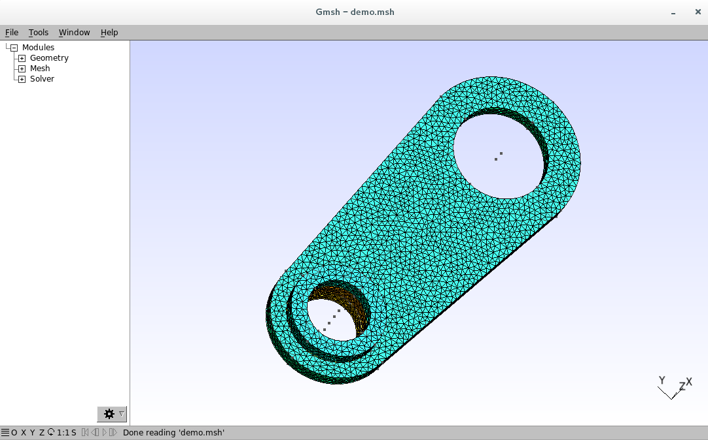

# GridapGmsh

[](https://travis-ci.com/gridap/GridapGmsh.jl)
[](https://codecov.io/gh/gridap/GridapGmsh.jl)


## Requirements

`GridapGmsh` requires a working instalation of the GMSH Software Development Kit (SDK) available at [gmsh.info](https://gmsh.info/). The `gmsh` binary has to be visible from the `which` command or the equivalent in your operating system.

## Demo




```julia
using Gridap
using GridapGmsh

model = GmshDiscreteModel("demo/demo.msh")

order = 1
diritags = ["boundary1", "boundary2"]

V = TestFESpace(
  reffe=:Lagrangian,
  order=1,
  valuetype=Float64,
  model=model,
  dirichlet_tags=["boundary1","boundary2"])

U = TrialFESpace(V,[0,1])

trian = Triangulation(model)
degree = 2
quad = CellQuadrature(trian,degree)

a(u,v) = ∇(v)⋅∇(u)
t_Ω = LinearFETerm(a,trian,quad)

op = AffineFEOperator(U,V,t_Ω)

uh = solve(op)
writevtk(trian,"demo",cellfields=["uh"=>uh])
```


## Gotchas

- Gmsh does not allow to include entities of different dimension in the same physical group. In order to overcome this limitation, all phsysical groups defined in Gmesh with the same name will be merged in the same physical tag independently of their dimension.

- Vertices are always assigned to the corresponding CAD entity. However, this is not true for higher dimensional objects (i.e., edges, faces, cells). The later objects are associated with the right CAD entity if and only if thay are present in a physical group of the same dimension of the object. If the object does not belong to a physical group of the same dimension, but it belongs to the clousure of a higher dimensional object appearing in a physical group, then the low dimensional object receives the CAD id of the high dimensional object. If several high dimensional objects fullfill this requirement, we choose one arbitrary of the lowest dimension possible. This ensures, that edges and faces are assigned to the right CAD entity if the are in the interior of the CAD entity. The same is not true if the object is on the boundary of the CAD entity. In this case, include the corresponding object in a physical group if the right CAD ids are required.

